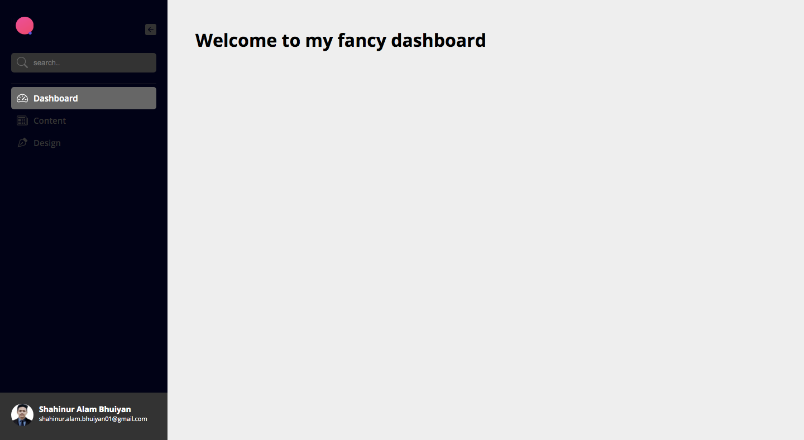

# React-fancy-dashboard
#### This is a website-dashboard.
here is the latest version-2.0 dashboard [Click_here](https://github.com/ShahinurAlamBhuiyan/react-dashboard-v2)
### [Live website](https://fancy-dashboard.netlify.app/)

## Feautures
+ By clicking menu item it will show it's component.
+ User can collapse side-menu by clicking arrow button.

## Technology :
+ React.js
+ React-router

## Let's take a look and don't forget to explore it!

